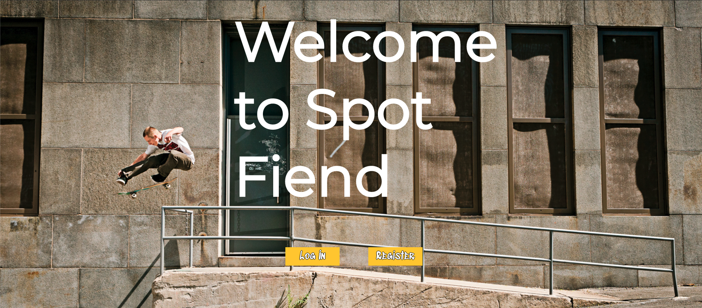
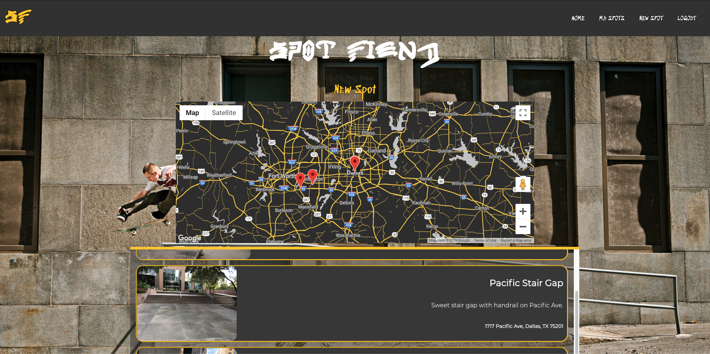
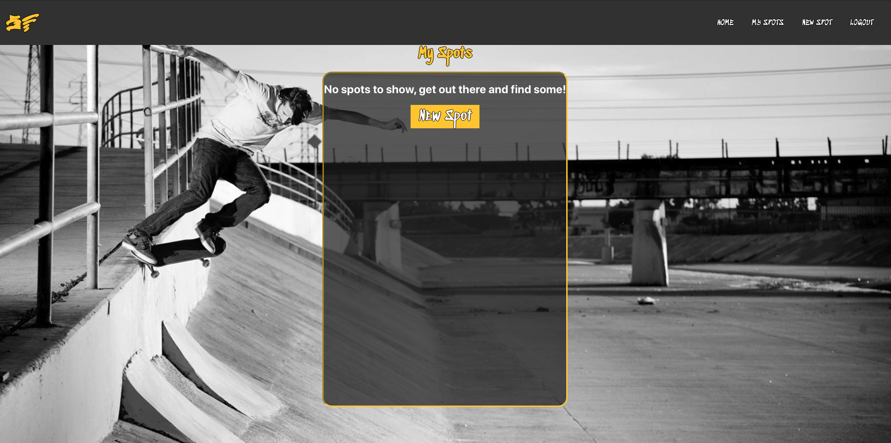
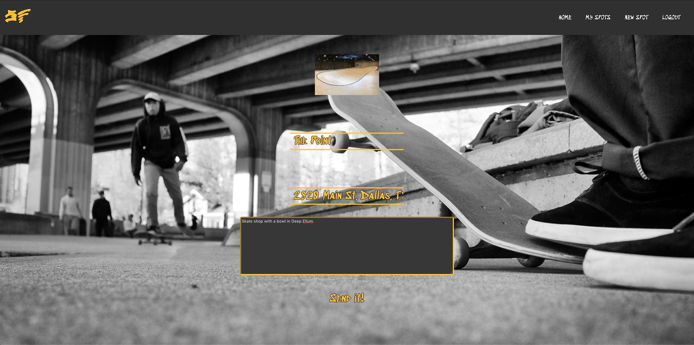
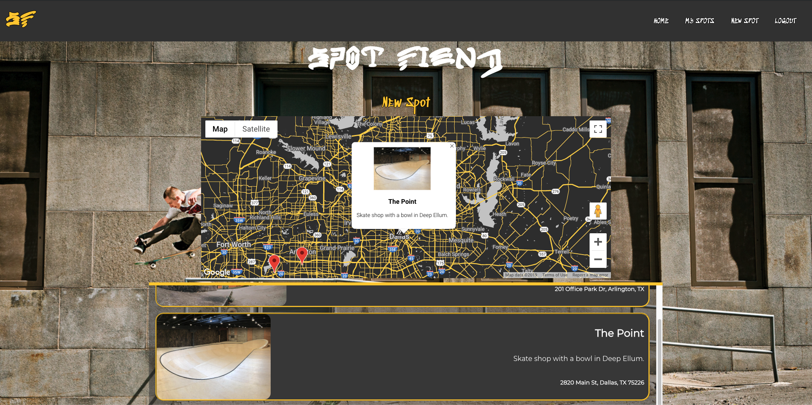
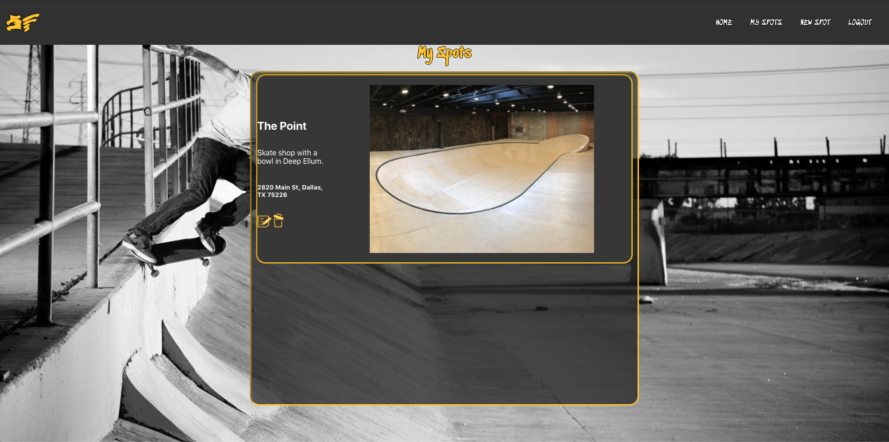

## Welcome to my first personal project!
The goal of this web application is to help skaters find 
new local spots to skate at, or to log their own findings.

Here you will create an account or log in with an existing account.

Behold the home page. This is where all submitted spots will come for all to see.
You can either look for spots near you on the map,
or you can view a compiled list of every spot submitted below the map.
Lets go look at the spots we've submitted so far.

It looks like we don't have any spots just yet, we can click on the 'new spot' button to go list our first spot.

This is where we can post a spot for the world to see. 
We can add our favorite shot of it, a creative title, 
the address it's located at, and a short description of our spot.

Now our spot will show up on the map and in our personal spot list.
Let's go check out our personal list.

Here we can view all the spots we've submitted and choose to edit them or delete them
altogether.

That's just about it, thanks for checking out my first website!